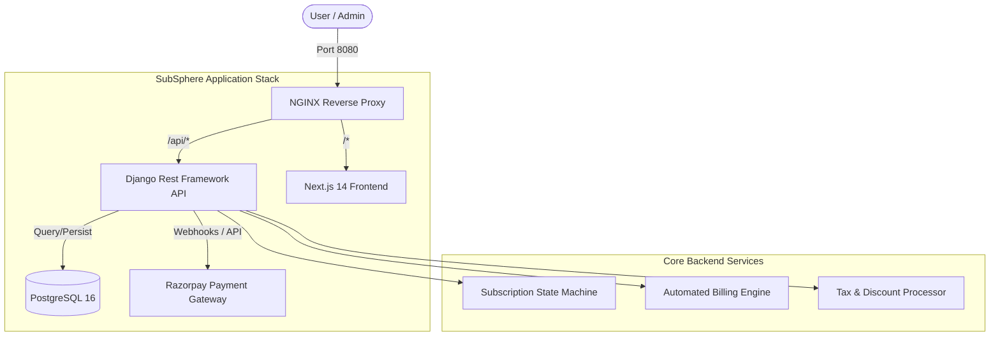

# SubSphere | Multi-Tenant SaaS Subscription Management

**SubSphere** is an enterprise-grade, multi-tenant SaaS Subscription Management platform built to solve complex recurring billing, product variant pricing, and automated invoicing logic. Originally developed as a hackathon prototype, it has evolved into a robust framework for handling end-to-end subscription lifecycles integrated with **Razorpay**.

---

## 🏗 Architecture & Design

SubSphere follows a modern microservices-adjacent architecture, fully containerized using Docker and orchestrated to run as a single unified application.

### System Architecture Diagram



---

## 🛠 Tech Stack

| Component | Technology | Description |
| :--- | :--- | :--- |
| **Backend** | Django 5.x & DRF | High-level Python web framework for rapid development. |
| **Frontend** | Next.js 14 (App Router) | React framework with Server-Side Rendering & TypeScript. |
| **Database** | PostgreSQL 16 | Advanced relational database for transactional integrity. |
| **Reverse Proxy** | NGINX | Unified routing, SSL termination, and static file serving. |
| **Payments** | Razorpay | Standard integration for orders, payments, and webhooks. |
| **Containerization**| Docker & Docker Compose | Seamless deployment and environment parity. |

---

## 🌟 Key Features

### 1. Advanced Subscription State Machine
Manage the entire lifecycle of a customer subscription with built-in transition logic:
`Draft` → `Quotation` → `Confirmed` → `Active` → `Closed`.
- **Auto-Confirmation**: Automated transitions based on payment triggers.
- **Expiration Logic**: System checks for valid dates and auto-closes expired plans.

### 2. Hierarchical Product & Variant Pricing
- **Product Types**: Support for both `Service` and `Physical` goods.
- **Dynamic Variants**: Add infinite attributes (Color, Size, Tier) with `extra_price` modifiers that recalculate totals on the fly.
- **Recurring Models**: Toggle between one-time purchases and recurring subscriptions.

### 3. Automated Invoicing & Tax Engine
- **Headless Invoicing**: The system can auto-generate `INV-{Date}-{Rand}` format invoices when a subscription is confirmed.
- **Tax Calculation**: Pluggable tax rates (GST/VAT) integrated directly into line items.
- **Discount Management**: Support for tiered discounts and promotional codes.

### 4. Seamless Razorpay Integration
- **Order Synchronization**: Back-end automatically mirrors orders in Razorpay.
- **Verification Hooks**: Signature verification ensures payment authenticity before updating internal states.
- **Webhook Support**: Ready for asynchronous payment notifications.

---

## 📂 Project Structure

```text
subsphere/
├── backend/                # Django Application
│   ├── apps/               # Modularized Django Apps
│   │   ├── users/          # Custom User Model & Auth
│   │   ├── subscriptions/   # Core Subscription Logic
│   │   ├── products/       # Product Variants & Inventory
│   │   ├── invoices/       # Automated Billing & PDF (ext)
│   │   ├── payments/       # Razorpay Integration
│   │   └── taxes/          # Tax Rules & Logic
│   ├── config/             # Project Settings & WSGI/ASGI
│   └── Dockerfile          # Python 3.12 Build Layer
├── frontend/               # Next.js Application
│   ├── src/app/            # App Router (Pages & Layouts)
│   ├── src/components/     # Shared UI Components
│   ├── src/lib/            # API Handlers & Utils
│   └── Dockerfile          # Node.js Build Layer
├── nginx/                  # Nginx Configuration
│   └── nginx.conf          # Reverse Proxy Rules
├── .env.example            # Environment Variable Template
└── docker-compose.yml      # Service Orchestration
```

---

## 🚀 Getting Started

### Prerequisites
- [Docker Desktop](https://www.docker.com/products/docker-desktop/) installed and running.
- Python 3.12 (if running locally without Docker).

### Quick Start (Docker)
1. **Clone and Configure**:
   ```bash
   cp .env.example .env
   # Update RAZORPAY_KEY and SECRET_KEY in .env
   ```
2. **Launch Services**:
   ```bash
   docker-compose up -d --build
   ```
3. **Initialize Database**:
   ```bash
   docker-compose exec backend python manage.py migrate
   docker-compose exec backend python manage.py createsuperuser
   ```
4. **Access the Platform**:
   - **User Frontend**: [http://localhost:8080](http://localhost:8080)
   - **Admin Dashboard**: [http://localhost:8080/admin/](http://localhost:8080/admin/)
   - **Swagger Docs**: [http://localhost:8080/api/docs/](http://localhost:8080/api/docs/)

---

## 📊 Database Schema (Core Models)

### `Subscription`
The heart of the system, linking users to plans and tracking status via a Choice-field state machine.
- `subscription_number`: Unique identifier (SUB-YYYYMMDD-RAND).
- `status`: draft, quotation, confirmed, active, closed.
- `lines`: Linked `SubscriptionLine` items for granular product tracking.

### `Product` & `ProductVariant`
Decoupled pricing structure allowing for complex variant combinations.
- `sales_price`: Base price.
- `extra_price`: Variant-specific price addition.

---

## 📝 API Documentation
SubSphere utilizes **drf-spectacular** to provide real-time, interactive API documentation. 
Navigate to `/api/docs/` to view the full Swagger UI where you can:
- Authenticate using JWT.
- Test endpoint payloads directly.
- View detailed Schema definitions for each model.

---

## 🗺️ Roadmap
- [ ] **Multi-Currency Support**: Dynamic FX conversion for global users.
- [ ] **PDF Generator**: Native Django service to generate and Email invoices.
- [ ] **Analytics Dashboard**: Real-time MRR/ARR tracking charts.
- [ ] **Mobile App**: React Native wrapper for the customer portal.

---

## 📄 License
Distributed under the MIT License. See `LICENSE` for more information.

---
*Maintained by the SubSphere Team - Building the future of recurring commerce.*
